# Eco-eco-grocery Store - MERN Stack

This is a full-stack e-commerce web application for a eco-grocery store, built using the MERN stack (MongoDB, Express.js, React.js, Node.js). The application provides a seamless shopping experience for users and a powerful dashboard for sellers to manage their products and orders.

---

## Features

### User Features:

* **User Authentication**: Secure user registration and login using JSON Web Tokens (JWT).
* **Product Browsing**: View all products with details, search, and filter by category.
* **Shopping Cart**: Add, remove, and manage items in the shopping cart.
* **Order Management**: Place orders, view order history, and track order status.
* **Address Management**: Add, edit, and select delivery addresses.
* **Secure Payments**: Integrated with Stripe for secure online payments.

### Seller Features:

* **Seller Authentication**: Separate login for sellers to access the seller dashboard.
* **Product Management**: Add, update, and delete products.
* **Order Fulfillment**: View and manage incoming orders.

---

## Screenshots

### User Authentication

| User Sign Up                                  | User Login                                |
| --------------------------------------------- | ----------------------------------------- |
| 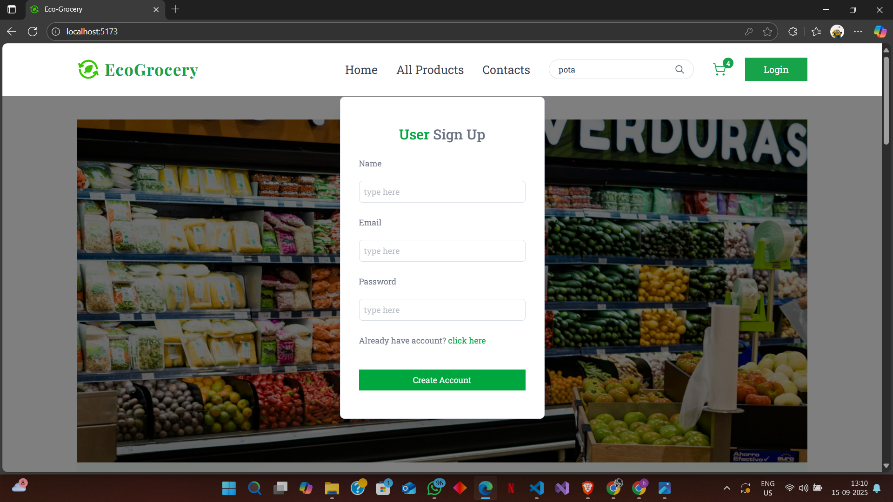      | 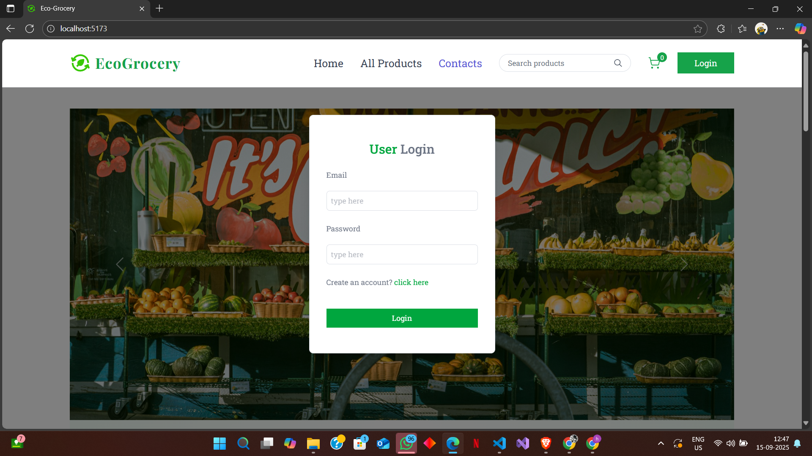      |

### Homepage

| Homepage View 1                               | Homepage View 2                               | Homepage View 3                               |
| --------------------------------------------- | --------------------------------------------- | --------------------------------------------- |
| 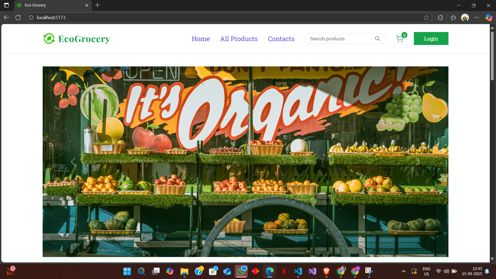    | 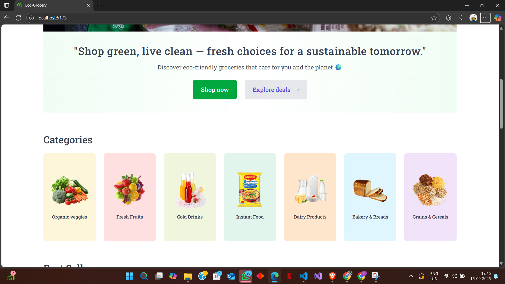    | 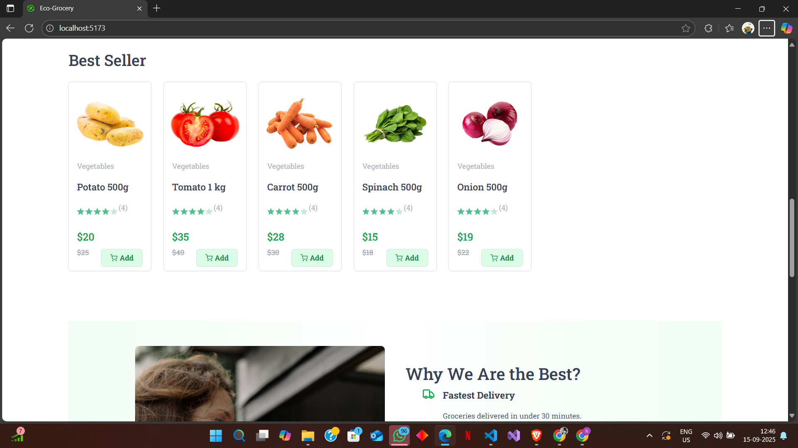    |
| **Homepage View 4** | **Homepage View 5** |
| 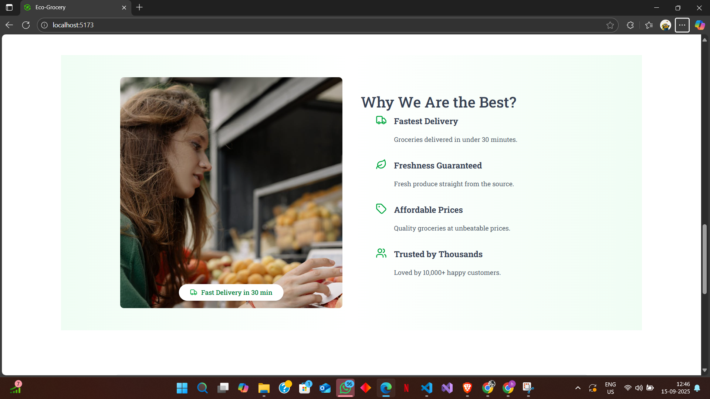    | 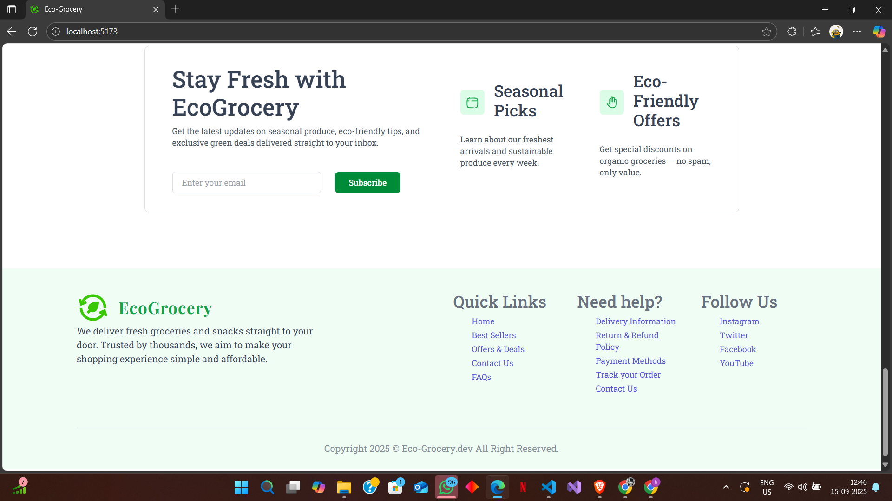    |

### Products & Cart

| All Products                                  | Shopping Cart                                  |
| --------------------------------------------- | ---------------------------------------------- |
| 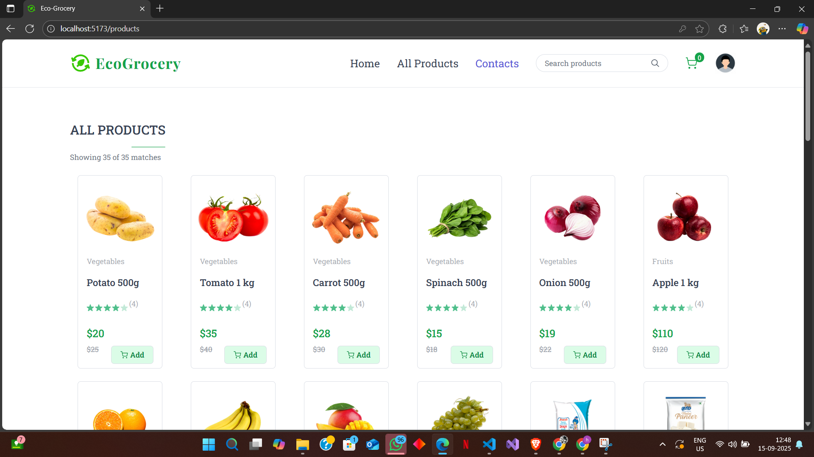      | 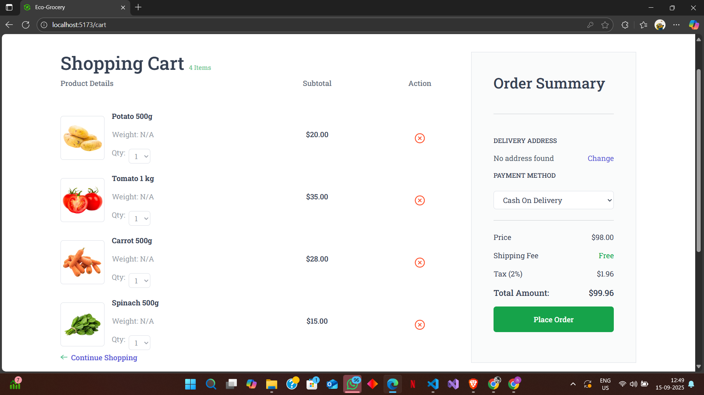     |

### User Features

| Add Address                                   |
| --------------------------------------------- |
| 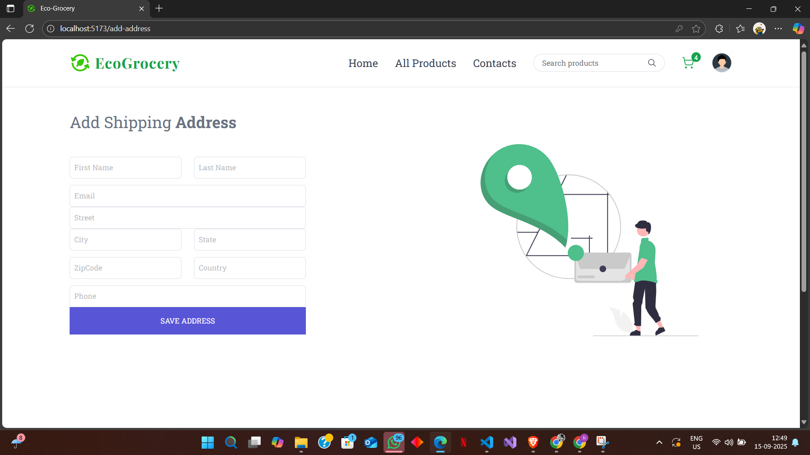        |

### Seller Features

| Seller Add Product                                 | Seller Product List                                   |
| -------------------------------------------------- | ----------------------------------------------------- |
| 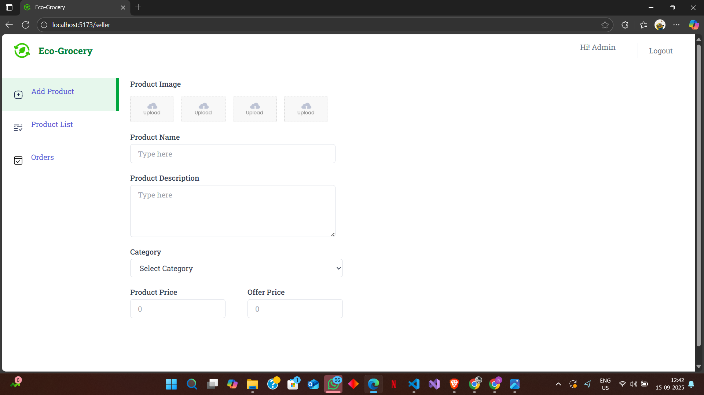 | 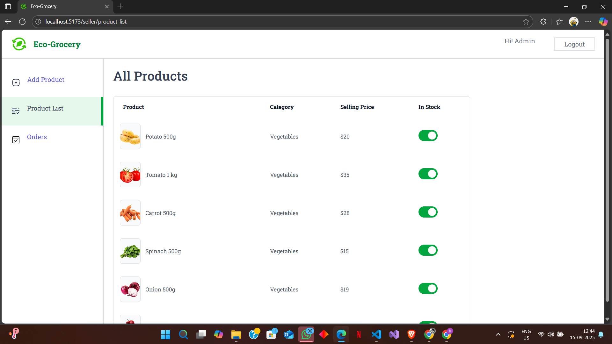 |


---

## Tech Stack

### Frontend:

* **React.js**: A JavaScript library for building user interfaces.
* **Vite**: A fast build tool for modern web development.
* **React Router**: For handling client-side routing.
* **Context API**: For state management.

### Backend:

* **Node.js**: A JavaScript runtime for building the server-side.
* **Express.js**: A web application framework for Node.js.
* **MongoDB**: A NoSQL database for storing application data.
* **Mongoose**: An Object Data Modeling (ODM) library for MongoDB and Node.js.
* **JSON Web Token (JWT)**: For secure user authentication.
* **Stripe**: For handling online payments.
* **Cloudinary**: For cloud-based image and video management.
* **Multer**: A middleware for handling `multipart/form-data`, used for file uploads.
* **bcrypt**: A library for hashing passwords.
* **CORS**: For enabling Cross-Origin Resource Sharing.
* **dotenv**: For managing environment variables.

---

## Getting Started

Follow these instructions to get a copy of the project up and running on your local machine for development and testing purposes.

### Prerequisites

* Node.js and npm installed on your machine.
* MongoDB installed and running.
* A Stripe account for payment processing.
* A Cloudinary account for image storage.

### Installation

1.  **Clone the repository:**

    ```bash
    git clone [https://github.com/vedant-rajput22/eco-grocery.git](https://github.com/vedant-rajput22/eco-grocery.git)
    ```

2.  **Navigate to the server directory and install dependencies:**

    ```bash
    cd eco-grocery/server
    npm install
    ```

3.  **Navigate to the frontend directory and install dependencies:**

    ```bash
    cd ../frontend
    npm install
    ```

### Configuration

1.  **Create a `.env` file in the `server` directory** and add the following environment variables:

    ```env
    PORT=3000
    MONGO_URI=<YOUR_MONGODB_CONNECTION_STRING>
    JWT_SECRET=<YOUR_JWT_SECRET>
    CLOUDINARY_CLOUD_NAME=<YOUR_CLOUDINARY_CLOUD_NAME>
    CLOUDINARY_API_KEY=<YOUR_CLOUDINARY_API_KEY>
    CLOUDINARY_API_SECRET=<YOUR_CLOUDINARY_API_SECRET>
    STRIPE_SECRET_KEY=<YOUR_STRIPE_SECRET_KEY>
    ```

2.  **Create a `.env` file in the `frontend` directory** and add the following:

    ```env
    VITE_API_URL=http://localhost:3000
    ```

### Running the Application

1.  **Start the backend server:**

    ```bash
    cd eco-grocery/server
    npm start
    ```

2.  **Start the frontend development server:**

    ```bash
    cd eco-grocery/frontend
    npm run dev
    ```

The application will be available at `http://localhost:5173`.

---

## API Endpoints

### User Routes

* `POST /api/user/register` - Register a new user.
* `POST /api/user/login` - Login a user.

### Product Routes

* `GET /api/products` - Get all products.
* `GET /api/products/:id` - Get a single product by ID.

### Cart Routes

* `POST /api/cart/add` - Add an item to the cart.
* `POST /api/cart/remove` - Remove an item from the cart.
* `GET /api/cart` - Get all items in the cart.

### Order Routes

* `POST /api/order/place` - Place a new order.
* `GET /api/order/myorders` - Get the order history for the logged-in user.

### Address Routes

* `POST /api/address/add` - Add a new address.
* `GET /api/address` - Get all addresses for the logged-in user.

### Seller Routes

* `POST /api/seller/register` - Register a new seller.
* `POST /api/seller/login` - Login a seller.
* `POST /api/seller/add-product` - Add a new product.
* `GET /api/seller/products` - Get all products for the logged-in seller.
* `GET /api/seller/orders` - Get all orders for the logged-in seller.

---

## Folder Structure
```
eco-grocery/
├── demo/
│   ├── user-sign-up.png
│   ├── add-address.png
│   ├── shopping-cart.png
│   ├── all-products.png
│   ├── user-login.png
│   ├── home-page-5.png
│   ├── home-page-4.png
│   ├── home-page-3.png
│   ├── home-page-2.png
│   ├── home-page-1.png
│   ├── seller-product-list.png
│   └── seller-add-product.png
├── frontend/
│   ├── public/
│   ├── src/
│   │   ├── assets/
│   │   ├── components/
│   │   ├── context/
│   │   ├── pages/
│   │   ├── App.jsx
│   │   ├── main.jsx
│   ├── .gitignore
│   ├── index.html
│   ├── package.json
│   └── vite.config.js
└── server/
    ├── configs/
    │   ├── cloudinary.js
    │   ├── db.js
    │   └── multer.js
    ├── controllers/
    │   ├── addressController.js
    │   ├── cartController.js
    │   ├── orderController.js
    │   ├── productController.js
    │   ├── sellerController.js
    │   └── userController.js
    ├── middlewares/
    │   ├── authSeller.js
    │   └── authUser.js
    ├── models/
    │   ├── Address.js
    │   ├── Order.js
    │   ├── Product.js
    │   └── User.js
    ├── routes/
    │   ├── addressRoute.js
    │   ├── cartRoute.js
    │   ├── orderRoute.js
    │   ├── productRoute.js
    │   ├── sellerRoute.js
    │   └── userRoute.js
    ├── .gitignore
    ├── package.json
    └── server.js
```